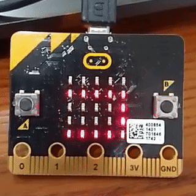

# microbit KATAKANA
microbit でカタカナ表示ができます


```python
from microbit import *
from katakana import Katakana

k = Katakana()
while True:
    k.display_kana("ko nn ni ti ha")
    sleep(2000)
```
 

## インストール(Install)

1. Muをインストールする
   * https://codewith.mu/
2. katakana.pyと sample.pyを C:\Users\%Username%\mu_code にコピーする
3. micro:bitとPCをつないでMuを起動
4. ファイルボタンを押し、katakana.pyをmicro:bitにコピーする

5. sample.pyを開いて転送ボタンを押す

